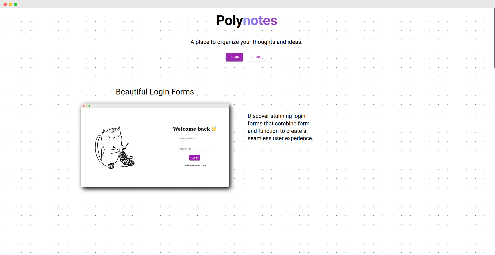
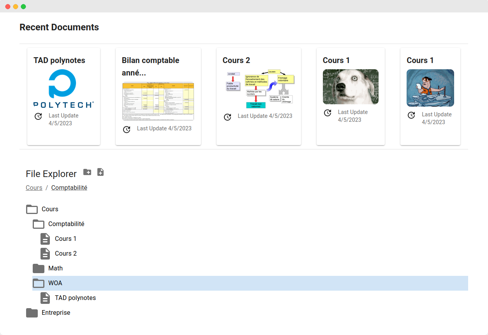
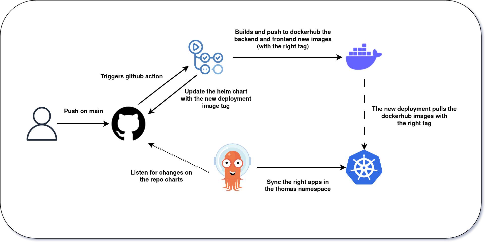

<div align="center"> 
<h1>Polynote</h1>

  
</div>

## Badges

[](https://wakatime.com/badge/user/385a7930-8af1-4967-9bb9-881eafcf79a6/project/04c974ff-1e8b-4749-afd6-6feae9f68f86)

## Screenshots

<!-- 
 -->

## Environment Variables

To run this project you will need to create 2 .env files, one in the frontend/ folder and one in the backend/ folder.
To help you fill the .env files you can copy the .env.example files and rename them to .env then fill the variables.

## Run Locally

### Prerequisites

- [Docker](https://docs.docker.com/get-docker/)
- [Docker-compose](https://docs.docker.com/compose/install/)
- [.env files](##Environment_Variables)

:warning: **Warning** :warning: : The mail service might not work locally, if you are not receiving the mail you can connect to the mongo database and change the emailVerified to true in the users collection.

**Clone the project**

```bash
  git clone git@github.com:thomas-mauran/Polynotes.git
```

**Go to the project directory**

```bash
  cd Polynotes
```

**Run the docker compose**

```bash
  docker-compose up
```

## Features

| Status | Feature                | Description                                                                                                                       |
| :----: | ---------------------- | --------------------------------------------------------------------------------------------------------------------------------- |
|   ✅   | Pages and Folders      | Create hierarchical structure of notes                                                                                            |
|   ✅   | One or Two Columns     | Choose between one or two columns for notes                                                                                       |
|   ✅   | Text Blocks            | Headers (h1, h2, h3), lists (bullet and ordered), and paragraphs for note content                                                 |
|   ✅   | Image Block            | Add images to notes via URL                                                                                                       |
|   ✅   | Gif picker Block       | Add Gif to notes via a gif picker component like the discord one                                                                  |
|   ✅   | Database               | Properties include Rich/plain text, Checkbox, Date & Time, Single Select, and Number. Views include Table and Kanban              |
|   ✅   | Sharing Content        | Share notes with anonymous users via generated link. Choose between Read-only or Read-write access                                |
|   ✅   | Manifesto              | Manifesto landpage with nice effects                                                                                              |
|   ✅   | Login and signup       | Signup and login with mail validation                                                                                             |
|   ✅   | CGU                    | Minimal CGU                                                                                                                       |
|   ✅   | Form validation        | basic form validation in front and backend                                                                                        |
|   ✅   | Profile                | only name and a logout button                                                                                                     |
|   ✅   | Recent open documents  | Tiles of recent open documents                                                                                                    |
|   ✅   | File Explorer          | minimal version - at least name, size, creation/last updated                                                                      |
|   ✅   | My workspace           | Workspace with all the documents and folders                                                                                      |
|   ✅   | CI/CD                  | Continuously integrated and deployed using Github action and arcod, more details in the [Infrastructure](##Infrastructure) section |
|   ✅   | Deployment             | Deployed on an online server. Instructions for deploying on your own server available in the repository.                          |
|   ✅   | Rich Text              | Rich text like **bold** _italic_ ~~strike-throught~~                                                                              |
|   ❌   | Search                 | Search notes by title or content                                                                                                  |
|   ❌   | Realtime collaboration | Collaborate with other users on notes in real-time   
|   ❌   | Page and folder delete | For the moment you can't delete a page or a folder from the client                                                                             |

## Swagger

Here is the link to the swagger documentation of the API: [Swagger Link](https://polynotes.cluster-2022-6.dopolytech.fr/api/swagger)

## Infrastructure

For this project and the following ones we decided with [@sylvain-pierrot](https://www.github.com/sylvain-pierrot) and [@charley04310](https://github.com/charley04310) to connect our k3s clusters into a single one. This way we can share the same infrastructure and deploy our applications on the same server allowing us in the future to have a fully scalable and secure infrastructure.


### CI/CD

To deploy a new version of the application you just need to merge it on the main branch and it will be automatically deployed on the server.



#### Explanation

Basically what happens is that, when you merge a pull request on the main branch, a Github action is triggered. This workflow will perform multiple actions. 

**1. Update the deployment charts**
First they will edit the backend and frontend helm charts to update the image tag with the new version. This version is built from the commit sha. 

**2. Build and push the new images to dockerhub**
Then, the github action will build and push the new docker images to dockerhub. During the docker build you will see that the backend doens't use any .env file. This is because the nodejs server allows us to use environment variables directly from the container. This way we can use the helm values to pass down the environment variables to the container. The sensible values are passed down as secrets using a common terraform repo for our cluster. The frontend on the other hand needs to be provided with the .env variables on build, especially the tenor api key which is sensible. 
This is why in the CI we use a github secret to pass down the tenor api key to the frontend. The frontend is then built and pushed to dockerhub. 

**3. Commit on the main branch**
Then when the github action is done it will commit on the main branch the new helm charts with the new image tag. This will trigger argocd to deploy the new version of the application. It will perform a blue/green deployment so that the application is always available.


## Roadmap

Polynotes is our main school project for the next 3 years. It is made of many itterations this being the first one that we had to do alone in 2 months. We are soon gonna start to work on the second itteration that will be a complete rewrite of the application with a new tech stack and new features and a team of 14 students.

## Tech Stack

**Client:**
| Tech Stack | Logo |
| --- | --- |
| Frontend | &nbsp;&nbsp;&nbsp;&nbsp;&nbsp;&nbsp;&nbsp;&nbsp; | |
| Backend / DB | &nbsp;&nbsp;&nbsp;&nbsp;&nbsp;&nbsp;&nbsp;&nbsp; |
| Infra | &nbsp;&nbsp;&nbsp;&nbsp;&nbsp;&nbsp;&nbsp;&nbsp;&nbsp;&nbsp;&nbsp;&nbsp; |
## License

[MIT](https://choosealicense.com/licenses/mit/)

## Authors

- [@thomas-mauran](https://www.github.com/thomas-mauran)
