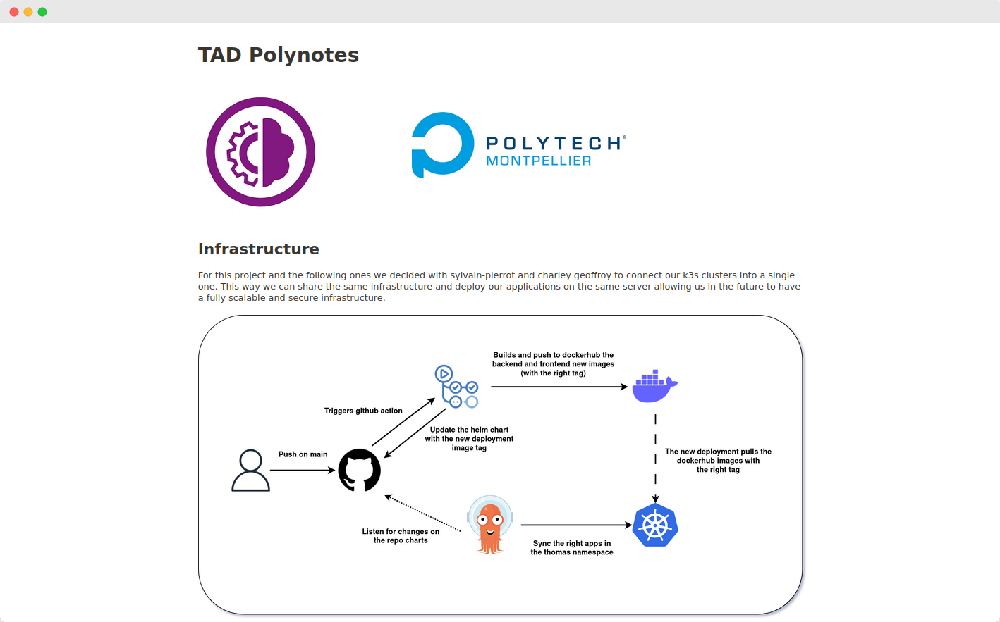
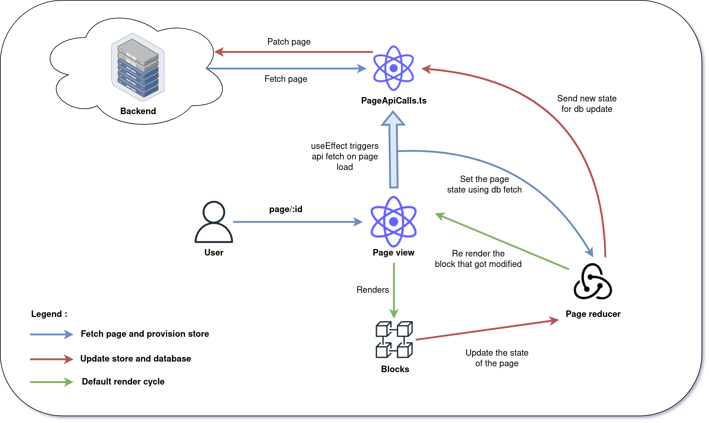
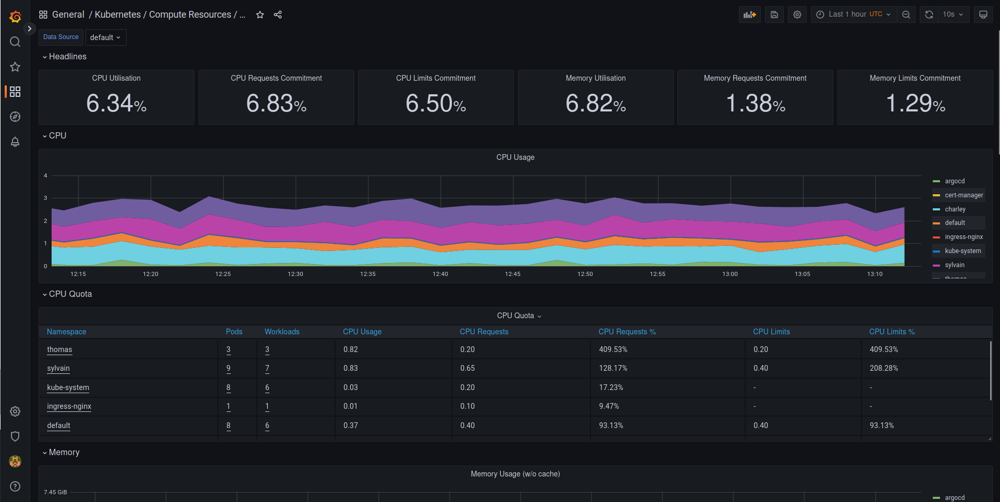

<div align="center"> 
<h1>Polynotes</h1>
<p>A place to organize your thoughts and ideas.</p>

  
</div>

-----

## Table of contents

- [Screenshots](#screenshots)
- [Roadmap](#roadmap)
- [Environment Variables](#environment-variables)
- [Run Locally](#run-locally)
  - [Prerequisites](#prerequisites)
- [Features](#features)
- [Frontend Architecture](#frontend-architecture)
  - [Page view and block render](#page-view-and-block-render)
- [Swagger API Documentation](#swagger-api-documentation)
- [Deployment infrastructure](#deployment-infrastructure)
  - [CI/CD](#ci-cd)
    - [Explanations](#explanations)
  - [Secret management](#secret-management)
- [Tech Stack](#tech-stack)
  - [Choices](#choices)
    - [Frontend](#frontend)
    - [Backend](#backend)
    - [Infrastructure](#infrastructure)
- [Conclusion](#conclusion)
- [License](#license)
- [Badges](#badges)
- [Authors](#authors)

## Screenshots

<div style="display: flex;">
    
    
    
</div>

## Roadmap

Polynotes is our main school project for the next 3 years. It is made of many itterations this being the first one that we had to do alone in 2 months. We are soon gonna start to work on the second itteration that will be a complete rewrite of the application with a new tech stack and new features and a team of 14 students.

## Environment Variables

To run this project you will need to create 2 .env files, one in the frontend/ folder and one in the backend/ folder.
To help you fill the .env files you can copy the .env.example files and rename them to .env then fill the variables.

## Run Locally

### Prerequisites

- [Docker](https://docs.docker.com/get-docker/)
- [Docker-compose](https://docs.docker.com/compose/install/)
- [.env files](#environment-variables)

:warning: **Warning** :warning: : The mail service might not work locally, if you are not receiving the mail you can connect to the mongo database and change the emailVerified to true in the users collection.

**Clone the project**

```bash
  git clone git@github.com:thomas-mauran/Polynotes.git
```

**Go to the project directory**

```bash
  cd Polynotes
```

**Run the docker compose**

```bash
  docker-compose up
```

## Features

| Status | Feature                | Description                                                                                                                       |
| :----: | ---------------------- | --------------------------------------------------------------------------------------------------------------------------------- |
|   ✅   | Pages and Folders      | Create hierarchical structure of notes                                                                                            |
|   ✅   | One or Two Columns     | Choose between one or two columns for notes                                                                                       |
|   ✅   | Text Blocks            | Headers (h1, h2, h3), lists (bullet and ordered), and paragraphs for note content                                                 |
|   ✅   | Image Block            | Add images to notes via URL                                                                                                       |
|   ✅   | Gif picker Block       | Add Gif to notes via a gif picker component like the discord one                                                                  |
|   ✅   | Database               | Properties include Rich/plain text, Checkbox, Date & Time, Single Select, and Number. Views include Table and Kanban              |
|   ✅   | Sharing Content        | Share notes with anonymous users via generated link. Choose between Read-only or Read-write access                                |
|   ✅   | Manifesto              | Manifesto landpage with nice effects                                                                                              |
|   ✅   | Login and signup       | Signup and login with mail validation                                                                                             |
|   ✅   | CGU                    | Minimal CGU                                                                                                                       |
|   ✅   | Form validation        | basic form validation in front and backend                                                                                        |
|   ✅   | Profile                | only name and a logout button                                                                                                     |
|   ✅   | Recent open documents  | Tiles of recent open documents                                                                                                    |
|   ✅   | File Explorer          | minimal version - at least name, size, creation/last updated                                                                      |
|   ✅   | My workspace           | Workspace with all the documents and folders                                                                                      |
|   ✅   | CI/CD                  | Continuously integrated and deployed using Github action and arcod, more details in the [Infrastructure](#infrastructure) section |
|   ✅   | Deployment             | Deployed on an online server. Instructions for deploying on your own server available in the repository.                          |
|   ✅   | Rich Text              | Rich text like **bold** _italic_ ~~strike-throught~~                                                                              |
|   ❌   | Search                 | Search notes by title or content                                                                                                  |
|   ❌   | Realtime collaboration | Collaborate with other users on notes in real-time                                                                                |
|   ❌   | Page and folder delete | For the moment you can't delete a page or a folder from the client                                                                |


## Frontend Architecture


### Page view and block render



**Schema explanation**

This schema explains the full process of rendering a page. Here is explained each part of the schema as splitted by arrow color.

**1. Blue arrows: Fetch page and provision store**
Whenever a user navigates to a page, on the /page/:id frontend route, the page view component useEffect gets triggered. This useEffect will call the [findPage](https://github.com/thomas-mauran/Polynotes/blob/445747c09437a20537643486284cda44ee87899f/frontend/src/utils/pages/pagesAPICalls.ts#L5) function that will fetch the page from the backend and return the page object. This page object will be used to provision the store with the page data.

**2. Red arrows: Update the store and the database**
Whenever a block gets updated it will always communicate with the store to update the page, this page update will also send the new page state to the database using the [updatePage](https://github.com/thomas-mauran/Polynotes/blob/445747c09437a20537643486284cda44ee87899f/frontend/src/utils/pages/pagesAPICalls.ts#L56) function. This function will send a PATCH request to the backend that will update the page in the database. Before refactoring it this way the page state was managed in the pageView component. It was passing as props to it's block child function to update it's store like an event driven architecture. This was not a good solution because the more block you add the more props you have to pass and take care of, it was adding a lot of complexity to the whole process. I really decided to refactor this part of the code when I had to make the multicolumn block. Since this block could also have child it would have been to much complex to manage the store in the pageView component. Whenever a block needs to update the store it will call a dispatch function and pass it's uuid. The dispatch function will then use reccursion to find the block in the store and proceed to the needed action. This way I didn't had to care about a `focus index` in the page state, I just had to care about the block uuid.

**3. Green arrows: Render cycle of the page**

When the page store is updated the pageView component will rerender the right block component. Rendering only the right block component is optimizing the rendering process and will prevent the page to rerender all the blocks when only one of them is updated. 


## Swagger API Documentation

Here is the link to the swagger documentation of the API: [Swagger Link](https://polynotes.cluster-2022-6.dopolytech.fr/api/swagger)

## Deployment infrastructure

For this project and the following ones we decided with [@sylvain-pierrot](https://www.github.com/sylvain-pierrot) and [@charley04310](https://github.com/charley04310) to connect our k3s clusters into a single one. This way we can share the same infrastructure and deploy our applications on the same server allowing us in the future to have a fully scalable and secure infrastructure. This infrastructure will be able to prevent sustain a lot of traffic and will be able to scale up and down automatically. With multiple nodes the cluster will be able to keep services up even if a node goes down.

### CI/CD

To deploy a new version of the application you just need to merge it on the main branch and it will be automatically deployed on the server.


#### Explanations

Basically what happens is that, when you merge a pull request on the main branch, a Github action is triggered. This workflow will perform multiple actions.

**1. Update the deployment charts**
First they will edit the backend and frontend helm charts to update the image tag with the new version. This version is built from the commit sha.

**2. Build and push the new images to dockerhub**
Then, the github action will build and push the new docker images to dockerhub. During the docker build you will see that the backend doens't use any .env file. This is because the nodejs server allows us to use environment variables directly from the container. This way we can use the helm values to pass down the environment variables to the container. The sensible values are passed down as secrets using a common terraform repo for our cluster. The frontend on the other hand needs to be provided with the .env variables on build, especially the tenor api key which is sensible.
This is why in the CI we use a github secret to pass down the tenor api key to the frontend. The frontend is then built and pushed to dockerhub.

**3. Commit on the main branch**
Then when the github action is done it will commit on the main branch the new helm charts with the new image tag. This will trigger argocd to deploy the new version of the application. It will perform a blue/green deployment so that the application is always available.

### Secret management

We use a common terraform repo to manage our secrets. This repo is used to create the secrets on the cluster in the correct namespaces. This terraform repo is also used to create our argocd projects without having to configure them from the web application. It was great to use terraform because it allows us to have a common infrastructure for all our projects. It was also a great introduction to terraform in general.

## Tech Stack

**Client:**
| Tech Stack | Logo |
| --- | --- |
| Frontend | &nbsp;&nbsp;&nbsp;&nbsp;&nbsp;&nbsp;&nbsp;&nbsp;&nbsp;&nbsp;&nbsp;&nbsp;&nbsp;&nbsp;&nbsp;&nbsp;&nbsp;&nbsp;&nbsp;&nbsp; | |
| Backend / DB | &nbsp;&nbsp;&nbsp;&nbsp;&nbsp;&nbsp;&nbsp;&nbsp; |
| Infrastructure | &nbsp;&nbsp;&nbsp;&nbsp;&nbsp;&nbsp;&nbsp;&nbsp;&nbsp;&nbsp;&nbsp;&nbsp;&nbsp;&nbsp;&nbsp;&nbsp;&nbsp;&nbsp;&nbsp;&nbsp;&nbsp;&nbsp;&nbsp;&nbsp;|

### Choices

In this section I will explain the choices I made for the tech stack and why I chose them. I will also explain the difficulties I encountered and how I solved them.

#### Frontend

 **React**

React was imposed as a requirement for the project. I had already used it for a small project but didn't have a big background with it. It was honestly harder than vue js, especially in the state and reactivity management. When using react I feel like I have to think more about the state management and the reactivity to optimize rendering and avoid unnecessary re-renders. Another thing I didn't appreciate was the way to manage the jsx html code. Things like conditional rendering or loops aren't as easy to read as in other frameworks like vue js or svelte.

 **Typescript**

I used Typescript to have a better development experience and to have a better code quality. I never used Typescript before but I had a good experience with it. I used it for the backend as well. Overall, I had some troubles with typing especially for an app like Polynotes where you don't know how the final data will look like. I also had some troubles with the types of the libraries I used. I had to use a lot of `as` to cast the types.

 **Redux**

I used Redux to manage the state of the application. It was the first time I worked with stores and I had some trouble at first understanding how it worked. Looking back at it, I should have been using the [create api](https://redux-toolkit.js.org/rtk-query/api/createApi) to manage the API calls. I made a `utils/` folder with a small infrastructure to manage the API calls.

 **MUI**

I used MUI for the UI components. It was honestly great and also the first time I used a component library. My code isn't amazing sometimes since I didn't know if it was better to style the component with the `sx` prop or to use a separate stylesheet but overall I had a good experience with it.

 **Vite**

I used Vite for the build tool. I was already using Vite in my Vue projects and had good experiences with it. Usually, I was using [create-react-app](https://github.com/facebook/create-react-app) for React app build, but I read some news about it being deprecated right before starting this project.

 **Tiptap**

To create the editor, I tried [react-contenteditable](https://www.npmjs.com/package/react-contenteditable) and [lexical](https://github.dev/facebook/lexical). The first one was great but wasn't designed for rich text. The second one was a bit too complex for my needs and I was having a lot of trouble configuring it the right way. I then found [tiptap](https://tiptap.dev/) which was exactly what I needed.

---

#### Backend

 **NestJS**

I didn't want to use Express once again so I decided to try NestJS since I had heard a lot of good things about it. The first hours were a bit hard to understand how it worked but after a while, when you understand the structure of a NestJS project, it's really easy to use. I noticed that the documentation was great and that it was really easy to find what I needed. Nest is great when having to code things that are not directly related to the business logic. Things like mail sending, authentication, swaggers, mongo connection, etc. are really easy to implement with Nest. The development experience was overall very smooth and fun.

 **Mongodb**

A document oriented database was I think one of the best choices for this kind of project. Whenever pages don't have strong relations between them, or when it's important to write fast, a document oriented database is a great choice.Even thought I am proud of the database structure, I think it could have been better. I feel like some parts are looking a bit like a relational database but for a first time it was a good introduction to practice what I learned in the mongo DB course.

---

#### Infrastructure

**ArgoCD**

I used ArgoCD to manage the deployment of the application. I knew about it since we use it in my compagny but never tried it before. Thanks to sylvain who told me to try it and helped me with the configuration I managed to setup a basic argocd environment on my own cluster before we merged our clusters. It was great to understand how it worked and to see how it could be used in a real project. We used a app of apps pattern to manage the different environments and be able to reuse the same configuration for the following projects.

**Helm**

I used helm to write the kubernetes manifests. I was already using basic helm charts in my previous projects by helm installing them but never wrote one from scratch. Since I wrote my manifest by hand, during my [last project](https://github.com/thomas-mauran/Polypedia) I knew how charts worked and how to use them. It was very handy to write clean and reusable manifests using values loops and conditions. I know understand way more how helm works and how to use it.

**Github actions**

I love github actions. I used them a lot in my [previous projects](https://github.com/SphinxQuiz/Sphinx-Frontend/actions) and I think they are a great tool to automate tasks. I used them to build and push the docker images to the registry and to modify the image number in the manifests. What I would have like to do is to use them to check the linting but I didn't have the time to do it.

**Terraform**

We used terraform with sylvain and charley to manage our cluster infrastructure as explained in the [secret management](#secret-management) section. I still need to gain some experience with terraform but I think it's a great tool to manage infrastructure.

 **Grafana**

We setup a grafana dashboard to monitor the cluster. I used the same [kube prometheus stack](https://github.com/prometheus-community/helm-charts/tree/main/charts/kube-prometheus-stack) that I used on my personal cluster. I think it's a great tool to monitor the cluster and to be able to see what's going on and understand where you can optimize ressources, either by upscalling or improving the codebase. I wanted to try adding a custom ELK stack to monitor the frontend logs and especially the localisation of the users to create a map in the admin dashboard but I didn't have the time to do it.

**Admin console dashboard example:**
  


## Conclusion

In the end I am happy with the result. I learned a lot of new things way more than expected and I am really happy to have been able to work on this project. Looking back at it I made multiple mistakes especially in the frontend part for things like the database block that I should have been designing by myself instead of trying to make two library work together since the result is not that great and that made me loose even more time in the end. Same thing for react redux, I could have save some time on the api calls by using the create api function provided. I also spent a lot of time refactoring my code multiple times, especially the page reducer part. 
This multiple refactors where due to new features like the database blocks or the multicolumn blocks that I didn't planned in the base conception of the infrastructure. I think that if I had planned it better I would have been able to save a lot of time. 
As making mistakes is part of learning I am happy to have made them to understand why they are mistakes and how to avoid them.

With more time I would have liked to refactor part of my code especially the pageView render to split it in multiple component and make it more readable. I would also have liked to add simple but very useful features like page / folder deletion and better styling on some parts.
## License

[MIT](https://choosealicense.com/licenses/mit/)

## Badges

[](https://wakatime.com/badge/user/385a7930-8af1-4967-9bb9-881eafcf79a6/project/04c974ff-1e8b-4749-afd6-6feae9f68f86)

## Authors

- [@thomas-mauran](https://www.github.com/thomas-mauran)
